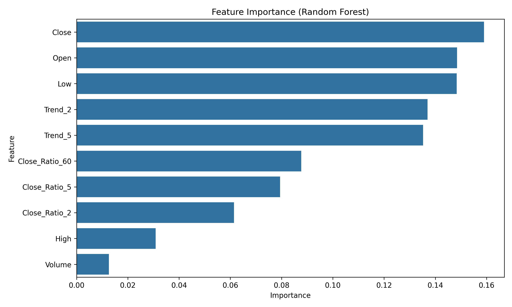
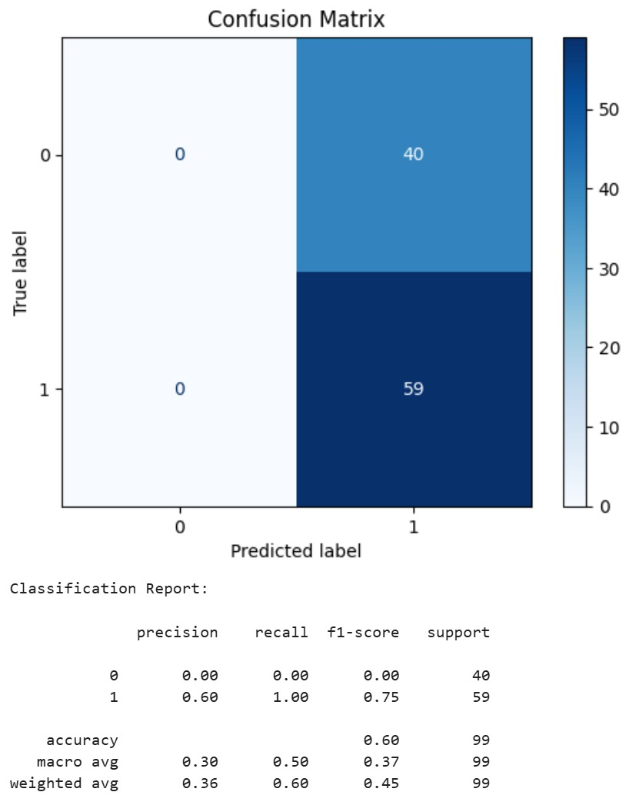
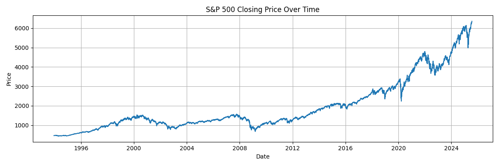

 >> Stock Price Movement Prediction (S&P 500)

This project predicts "whether the stock price will go up or down the next day" using a classification model trained on S&P 500 data.

>>  Key Features

- Used historical *S&P 500 data* from Yahoo Finance
- Engineered features using *rolling averages* (2, 5, 60, 250, 1000-day windows)
- Trained a *Random Forest Classifier* to predict price movement
- Evaluated performance using *confusion matrix* and *feature importance*

>> Output Visuals

> Feature Importances

> Confusion Matrix

> S&P 500 Trend

>> Model Insights

- Achieved a precision score of ~57%
- Feature engineering on historical prices shows predictive patterns
- Learnings on overfitting and the importance of financial domain knowledge

>> Tech Stack

- Python, Pandas, NumPy
- scikit-learn
- Matplotlib & Seaborn
- Jupyter Notebook

>> Try it Yourself

1. Clone the repo  
   git clone https://github.com/manasvi-kakar/stock_prediction.git
2. Run the notebook  
   jupyter notebook stock_prediction.ipynb

>> License

Free to use for educational and non-commercial purposes.
